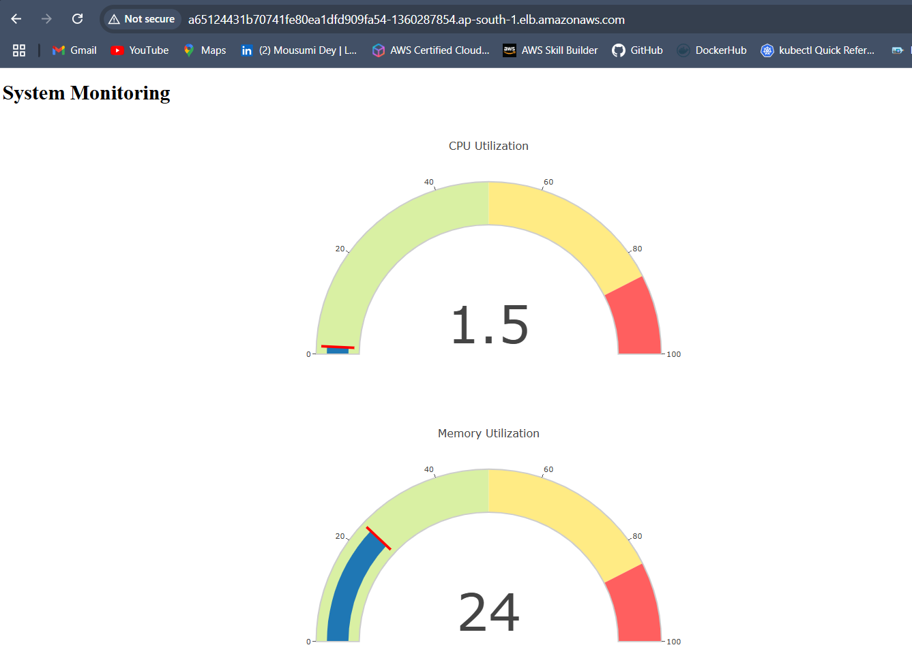
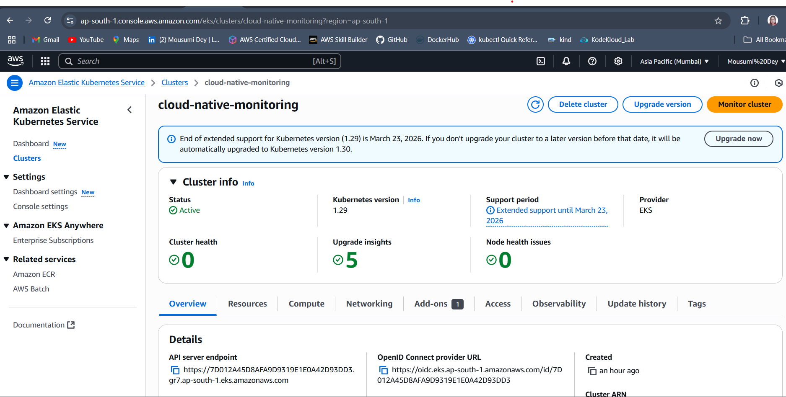
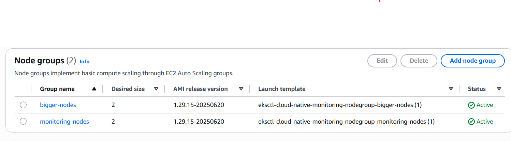
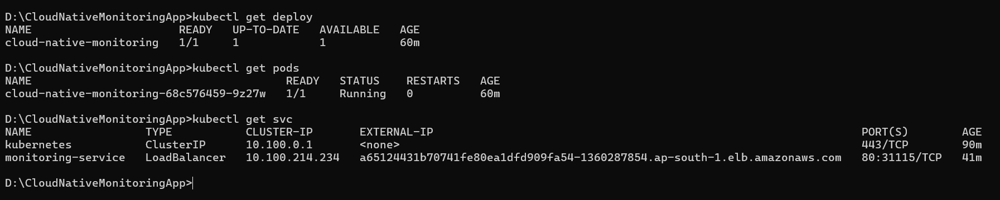

# 🌐 Cloud Native Monitoring App

A  cloud-native web application that displays **real-time CPU and memory usage** of the server where it's deployed. Built using **Python Flask**, containerized with **Docker**, and deployed to **Amazon EKS (Elastic Kubernetes Service)** for scalability and high availability.

---

## 🚀 Features

- 📊 Real-time system resource monitoring (CPU & memory)
- 🐳 Dockerized Flask application
- ☁️ Deployed on AWS using Amazon EKS
- 🌍 Accessible via public LoadBalancer
- ⚙️ Kubernetes-based orchestration

---

## 🛠️ Tech Stack

- **Backend**: Python (Flask)
- **Containerization**: Docker
- **Cloud Platform**: AWS (EKS, EC2)
- **Orchestration**: Kubernetes
- **Infrastructure as Code**: YAML (K8s Manifests)

---

## 📥 Deployment Instructions


```bash
# Pull the pre-built image from DockerHub
docker pull mousumidey/flask-app:latest

# Run the container locally (optional)
docker run -d -p 5000:5000 mousumidey/flask-app:latest

# Apply Kubernetes manifests
kubectl apply -f deployment.yaml
kubectl apply -f service.yaml

```
---

You can find the Docker image here:  
[https://hub.docker.com/repository/docker/mousumidey/flask-app](https://hub.docker.com/repository/docker/mousumidey/flask-app)


### 📸 Project Screenshots
Below are a few screenshots from the Cloud Native Monitoring Application:
 
  

  


